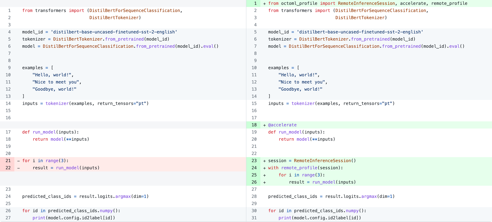

## octoml-profile

octoml-profile is a python library and cloud service
designed to provide the **simplest experience** for running 
PyTorch models on cloud hardware with state-of-the-art ML acceleration technology.

It is suited for benchmarking PyTorch based AI applications before
they are deployed into the cloud.

### Documentation quick links

* [Why octoml-profile?](#why-octoml-profile)
* [Installation](#installation)
* [Getting started](#getting-started)
* [Behind the scenes](#behind-the-scenes)
* [Known issues](#known-issues)
* [Contact the team](#contact-the-team)

### Example required code change



### Example results

```
    Runs discarded because compilation occurred: 1
    Profile 1/1:
    Segment                       Runs  Mean ms  Failures
    =====================================================
    0  Uncompiled                    9    0.051

    1  Graph #1
        r6i.large/onnxrt-cpu        90    0.037         0
        g4dn.xlarge/onnxrt-cuda     90    0.135         0

    2  Uncompiled                    9    0.094
    -----------------------------------------------------
    Total uncompiled code run time: 0.145 ms
    Total times (compiled + uncompiled) per backend, ms:
        r6i.large/onnxrt-cpu     0.182
        g4dn.xlarge/onnxrt-cuda  0.279

```


## Why octoml-profile?

Benchmarking deep learning models for cloud deployment is an intricate and
tedious process. This challenge becomes more significant as the boundary
between model and code continues to blur. As we witness in the
rise of generative models and the increasing popularity of PyTorch, exporting
models from code and selecting the optimal hardware deployment
platform and inference backend becomes a daunting task even for expert ML engineers.

With octoml-profile, you can easily run performance/cost measurements on a wide
variety of different hardware and apply state-of-the-art ML acceleration
techniques, all from your development machine, using the same data and workflow used for
training and experiment tracking, without tracing or exporting the model!

With just a few lines of code change and  running the code locally,
you instantly get performance feedback on your model's compute-intensive
tensor operations

- on each hardware instance type
- with automatic application of state-of-the-art ML acceleration technologies
- your model's data shapes and types can vary

but without the burden of

- exporting the models and stitch them back with pre/post processing code
- provisioning the hardware
- preparing the hardware specific dependencies, i.e. the version of PyTorch, Cuda, TensorRT etc.
- sending the model and data to each hardware and running the benchmarking script

This agile loop enables anyone familiar with PyTorch to rapidly iterate over
their model and the choice of hardware / acceleration technique to meet their
deployment goals without "throwing the model over the fence and back".


## Installation

- We're in beta mode, so if you haven't yet been granted access to octoml-profile,
  please send an email to dynamite@octoml.ai indicating interest in trying octoml-profile.
  We plan to fully open up access to the public around mid-late March 2023.

- Once you have access, generate an access token at https://app.octoml.ai/dynamite. Set the token as the env var below.
  ```
  export OCTOML_PROFILE_API_TOKEN=<access token>
  ```
- Create and activate a python virtual environment. Make sure that you are using python3.8.

  using virtualenv:
  ```
  python3.8 -m venv env
  . env/bin/activate
  ```

  or using conda:
  ```
  conda create -n octoml python=3.8
  conda activate octoml
  ```
- Install torch2.0
  ```
  pip install --pre "torch>=2.0.0dev" "torchvision>=0.15.0.dev" "torchaudio>=2.0.0dev" --extra-index-url https://download.pytorch.org/whl/nightly/cpu
  ```
- Install octoml-profile
  ```
  pip install octoml-profile
  ```

  If you have MacOS with Apple Silicon (M1), there are a few more  prerequisites:
  ```
  # Instructions on installing conda on MacOS: https://docs.conda.io/projects/conda/en/latest/user-guide/install/macos.html
  conda install onnx=1.12.0
  pip install grpcio==1.51.1 grpcio-tools==1.48.2
  ```


## Getting Started

All example code, including applications from `transformers`, can be found at [examples/](examples).

Below is a very simple example that shows how to integrate octoml-profile
into your model code.

```python
import torch
import torch.nn.functional as F
from torch.nn import Linear, ReLU, Sequential
from octoml_profile import (accelerate,
                            remote_profile,
                            RemoteInferenceSession)

model = Sequential(Linear(100, 200), ReLU(), Linear(200, 10))

@accelerate
def predict(x: torch.Tensor):
    y = model(x)
    z = F.softmax(y, dim=-1)
    return z

# Alternatively you can also directly use `accelerate`
# on a model, e.g. `predict = accelerate(model)` which will leave the
# softmax out of remote execution

session = RemoteInferenceSession()
with remote_profile(session):
    for i in range(10):
        x = torch.randn(1, 100)
        predict(x)
```

Running this program results in the following output that shows 
times of the function being executed remotely on each backend.
```
    Runs discarded because compilation occurred: 1
    Profile 1/1:
    Segment                       Runs  Mean ms  Failures
    =====================================================
    0  Uncompiled                    9    0.028

    1  Graph #1
        r6i.large/onnxrt-cpu        90    0.013         0
        g4dn.xlarge/onnxrt-cuda     90    0.088         0

    2  Uncompiled                    9    0.013
    -----------------------------------------------------
    Total uncompiled code run time: 0.042 ms
    Total times (compiled + uncompiled) per backend, ms:
        r6i.large/onnxrt-cpu     0.055
        g4dn.xlarge/onnxrt-cuda  0.130
```
You can think of `Graph #1` as the computation graph which captures
`model` plus `softmax` in the `predict` function. See
the [Uncompiled Segments](#uncompiled-segments) for more information
on the uncompiled blocks.

`Graph #1` shows 90 runs because the `for loop` runs the
`predict` function 10 times. On each loop iteration the model is evaluated
remotely 10 times. However, the result of the first remote run is
discarded because compilation is triggered.

To understand what's happening behind the scenes, read on. To see
more examples, see [examples/](examples).

## Behind the scenes

* [How octoml-profile works](#how-octoml-profile-works)
* [Where `@accelerate` should be applied](#where-accelerate-should-be-applied)
* [Quota](#quota)
* [Supported backends](#supported-backends)
* [Uncompiled segments](#uncompiled-segments)

### How octoml-profile works

In the example above, we first decorate the `predict` function with the
`@accelerate` decorator. Whenever the function is executed, the decorator uses
[Torch Dynamo](https://pytorch.org/tutorials/intermediate/dynamo_tutorial.html)
to extract one or more computation graphs, and offload them to the remote
inference worker for execution. These are referred to as `compiled code runs`
in the output.

Code that is not PyTorch computation graphs cannot be offloaded -- such code
runs locally and is shown as `uncompiled code run`. For more details on uncompiled code see
the [uncompiled segments section](#uncompiled-segments) below.

The `RemoteInferenceSession` is used to reserve
exclusive hardware access specified in the `backends` parameter.
If there are multiple backends, they will run in parallel.

The beauty of this example is that the decorator's scope
can be larger than the scope of PyTorch models, whose boundaries
are difficult to carve out exactly.

The `predict` function may contain pre/post processing code, non tensor logic
like control flows, side effects, and multiple models. Only eligible graphs
will be intelligently extracted and offloaded for remote execution.

From a user's perspective the "Total times (compiled + uncompiled) per backend"
is the best estimation of the runtime of decorated function with the chosen 
hardware platform and acceleration library.

### Where `@accelerate` should be applied
In general, `@accelerate` is a drop and replacement for `@torch.compile`
and should be applied to function which contains PyTorch Model that performs inference.
When the function is called under the context manager of `with remote_profile()`,
the remote execution and profiling activated. When called without `remote_profile()`
it behaves just as TorchDynamo.

By default, `torch.no_grad()` is set in the remote_profile context to minimize usage of non
PyTorch code in the decorated function. This minimizes the chance of hitting
`TorchDynamoInternalError`.

Last but not least, `@accelerate` should not be used to decorate a function
that already been decorated with `@accelerate` or `@torch.compile`.

### Quota

Each user has a limit on the number of concurrent backends held by the user's sessions.
If you find yourself hitting quota limits, please ensure you are closing previously held sessions
with `session.close()`. Otherwise, your session will automatically be closed at script exit.

### Supported backends

To programmatically access a list of supported backends, please invoke:

```python
RemoteInferenceSession().print_supported_backends()
```

**Supported Cloud Hardware**

AWS
- g4dn.xlarge (Nvidia T4 GPU)
- g5.xlarge  (Nvidia A10g GPU)
- r6i.large (Intel Xeon IceLake CPU)
- r6g.large (Arm based Graviton2 CPU)

**Supported Acceleration Libraries**

ONNXRuntime
- onnxrt-cpu
- onnxrt-cuda
- onnxrt-tensorrt

If no backends are specified while creating the `RemoteInferenceSession(backends: List[str])`, the default backends `g4dn.xlarge/onnxrt-cuda` and `r6i.large/onnxrt-cpu` are used for the session.

### Uncompiled segments

You will likely see `Uncompiled segments` in the profiling report. It is caused
by [graph breaks](https://pytorch.org/docs/master/dynamo/troubleshooting.html#graph-breaks)
in the decorated function.

It's easier to illustrate using an example
```python
import torch.nn.functional as F
import time

def function_with_graph_breaks(x):
    time.sleep(1) # Uncompiled segment 0
    x = F.relu(x) # graph #1, segment 1
    torch._dynamo.graph_break() # Uncompiled segment 2
    time.sleep(0.1) # continue segment 2
    x = F.relu(x) # graph #2, segment 3
    time.sleep(1) # Uncompiled segment 4
    return x

sess = RemoteInferenceSession('r6i.large/onnxrt-cuda')
with remote_profile():
    for _ in range(2):
        function_with_graph_breaks(torch.tensor(1.))
```

```
Profile 1/1:
   Segment             Runs   Mean ms  Failures
===============================================
0  Uncompiled             1  1001.051

1  Graph #1
     local/onnxrt-cpu    10     0.007         0

2  Uncompiled             1   100.150

3  Graph #2
     local/onnxrt-cpu    10     0.007         0

4  Uncompiled             1  1000.766
-----------------------------------------------
```
In the example above, we explicitly insert `graph_break`.
In real case, TorchDynamo will automatically
insert graph break when encoutering code that cannot be captured
as part of the computation graph. As a side effect of
us relying on TorchDynamo graph capturing, even a simple function as the one
below will always have Uncompiled segment in the beginning and the end because 
we cannot differentiate if there is non graph user code before or after `relu`.

```python
@accelerate
def simple_function(x):
    # implicit uncompiled segment 0
    x = F.relu(x) # graph #1, segment 1
    # implicit uncompiled segment 2
    return x
```


Uncompiled segment is run locally once for every invocation. The total
uncompiled time is summed up and add to the estimated total time (compiled and
uncompiled).

To print graph breaks and understand more of what TorchDynamo is doing under the hood, see
the [dynamo.explain](https://pytorch.org/tutorials/intermediate/dynamo_tutorial.html#torchdynamo-and-fx-graphs)
and
[PyTorch
Troubleshooting](https://pytorch.org/docs/master/dynamo/troubleshooting.html#torchdynamo-troubleshooting)
pages.

## Known issues

### Waiting for Session
When you create a session, you get exclusive access to the requested hardware.
When there are no hardware available, new session requests will
be queued.

### OOM for large models
When a function contains too many graph breaks,
the remote inference worker may run out of GPU memory.
When it happens, you may get an "Error on loading model component". 
This is known to happen with models like GPT2 and Stable Diffusion.
We are actively working on optimizing the memory allocation of 
many subgraphs.

### Dynamic shapes
When running inference with different shapes of inputs, i.e. dynamic
batch size or sequence length, each new shape will create new PyTorch 
graphs which trigger multiple graph uploads, each with static input shapes.
Like the "many graph" scenarios above, it can lead to less pleasant user
experience for benchmarking and unrealistic situation for deployment.

We are actively tracking the status of Torch2.0 symbolic shape branch
and will improve support for dynamic shapes in future releases.

### Limitations of TorchDynamo 
TorchDynamo is under active development. You may encounter
errors that are TorchDynamo related. For instance,
we found that TorchDynamo does not support `Ultralytics/Yolov5`.
These should not be fundamental problems as we believe TorchDynamo
will continue to improve its coverage.
If you find a broken model, please [file an issue](https://github.com/octoml/octoml-profile/issues).

## Contact the team
- Slack: [OctoML community slack](https://join.slack.com/t/octoml-community/shared_invite/zt-1p9oeslx1-4tgVpQmM9hvmVzCuxIH3Ug)
- Github issues: https://github.com/octoml/octoml-profile/issues
- Email: dynamite@octoml.ai

