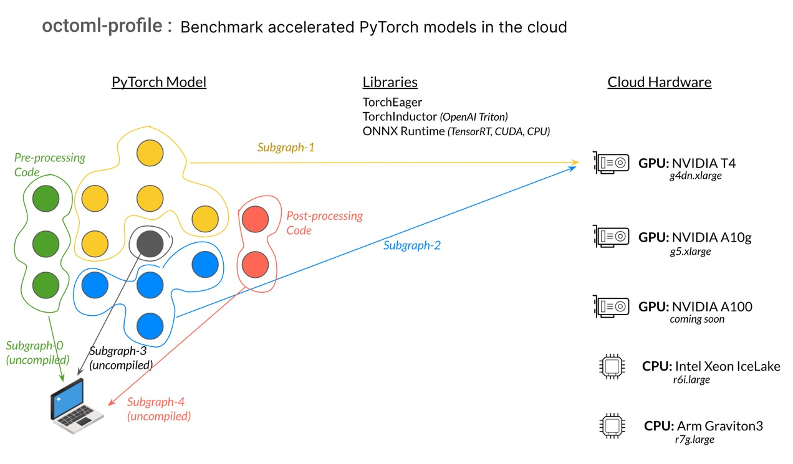

## octoml-profile

*octoml-profile* is a python library and cloud service that enables ML
engineers to easily assess the performance and cost of PyTorch models on cloud
hardware with state-of-the-art ML acceleration technology.

Whether you're building machine learning models for research, development, or
production, benchmarking your AI applications is a necessary step before
deployment. An optimally chosen hardware + runtime deployment strategy can
reduce cloud costs by more than 10x over default solutions.

With *octoml-profile*, within minutes, you can measure the performance and
cost of your PyTorch models on different cloud hardware. Our ML
acceleration technology ensures that you get the most accurate and efficient
results, so you can make informed decisions about how to optimize your AI
applications.

*Note: this tool is not designed for profiling individual PyTorch
ops on the local machine. Please use `torch.profiler` for such purpose.*


### Key Features
- 🔧 Magic remote execution with only a few additional lines of code
- 💻 Runs on local development environment without any GPU requirement
- 💪 Absolves tedious tasks such as model export, hardware provisioning, and dependency preparation
- 🚀 Provides performance and cost insights within seconds (or minutes for larger models)
- ⚙️  Supports diverse hardware and state-of-the-art software backends
- 🌟 Supports the latest generative AI models with dynamic shapes
- 📊 Uses the same data and workflow as your training and experiment tracking


### Limitation
- Only supports inference workload


### Demos
- [SentenceTransformers](examples/sentence_transformers/SentenceTransformerEval.ipynb)
- [Stable Diffusion](examples/stable_diffusion.py)
- [GPTNeo](examples/gpt_neo_125m.py)
- [Whisper](examples/whisper.py)
- [T5](examples/t5.py)


### Latest
- [04-25-2023] Client update `v0.2.2` with enhanced terminal output and more examples
- [03-22-2023] Initial release of `v0.2.0`


### Documentation quick links
* [Installation and Getting Started](#installation-and-getting-started)
* [Dynamic shapes](#dynamic-shapes)
* [How it works](#how-it-works)
* [Data privacy](#data-privacy)
* [Known issues](#known-issues)
* [Contact the team](#contact-the-team)

### "Hello World" example

Let's say you have a PyTorch model that performs sentiment analysis using a
DistilBert model, and you want to optimize it for cloud deployment. With
octoml-profile, you can easily benchmark the predict function on various cloud
hardware and use different acceleration techniques to find the optimal
deployment strategy.


Within a few seconds, you will find the runtime and cost that help you pick the
optimal hardware and inference engine for deployment.

```
Function `predict` has 1 profile:
- Profile `predict[1/1]` ran 3 times. (1 discarded because compilation happened)

Instance     Processor           Backend              Backend Time (ms)  Total Time (ms)  Cost ($/MReq)
=======================================================================================================
r6i.large    Intel Ice Lake CPU  torch-eager-cpu                 24.735           52.009          $1.82
g4dn.xlarge  Nvidia T4 GPU       torch-eager-cuda                 5.336           32.610          $4.76
g4dn.xlarge  Nvidia T4 GPU       torch-inductor-cuda              3.249           30.523          $4.46
g4dn.xlarge  Nvidia T4 GPU       onnxrt-cuda                      1.399           28.673          $4.19
-------------------------------------------------------------------------------------------------------
Total time above is `remote backend time + local python code time`,
 in which local python code run time is 27.274 ms.
Graph level profile is located at /tmp/octoml_profile_n603dewx/0/predict_1*
```

## Installation and Getting Started
- Create and activate a python virtual environment. `Python 3.8` is recommended
  and tested on both `Ubuntu` and `macOS`. `Python 3.10.9` is tested on `macOS`
  with Apple silicon.

  ```
  python3 -m venv env
  source env/bin/activate
  ```
- Install dependencies

  PyTorch 2.0 and above is required. Below we install the cpu version for
  simplicity; CUDA version works too.

  ```
  pip install --upgrade pip
  pip install "torch>=2.0.0" torchvision torchaudio --index-url https://download.pytorch.org/whl/cpu
  pip install "octoml-profile>=0.2.0"
  ```

  You've completed installation! (If you have trouble, see [issues with installation](#issues-with-installation))

- Next, try running this very simple example that shows how to integrate octoml-profile into your model code.

  ```python
  import torch
  from torch.nn import Linear, ReLU, Sequential
  from octoml_profile import accelerate, remote_profile

  model = Sequential(Linear(100, 200), ReLU())

  @accelerate
  def predict(x: torch.Tensor):
      return model(x)

  with remote_profile():
      for _ in range(3):
          x = torch.randn(1, 100)
          predict(x)
  ```

- The first time you run this, you'll be prompted to supply your API key.  

  ```
      ,-""-.
    /      \    Welcome to OctoML Profiler!
    :        ;
    \      /    It looks like you don't have an access token configured.
      `.  .'     Please go to https://profiler.app.octoml.ai/ to generate one
    '._.'`._.'   and then paste it here.

  Access token: 
  ```
  (<a href="https://profiler.app.octoml.ai/">Sign up</a> so that you can generate an API token when prompted)

- Once you've provided credentials, running this results in the following
  output that shows times of the function being executed remotely on each
  backend.

  ```
  Function `predict` has 1 profile:
  - Profile `predict[1/1]` ran 3 times. (1 discarded because compilation happened)

  Instance     Processor           Backend              Backend Time (ms)  Total Time (ms)  Cost ($/MReq)
  =======================================================================================================
  r6i.large    Intel Ice Lake CPU  torch-eager-cpu                  0.024            0.086          $0.00
  g4dn.xlarge  Nvidia T4 GPU       torch-eager-cuda                 0.097            0.159          $0.02
  g4dn.xlarge  Nvidia T4 GPU       torch-inductor-cuda              0.177            0.239          $0.03
  -------------------------------------------------------------------------------------------------------
  Total time above is `remote backend time + local python code time`,
  in which local python code run time is 0.062 ms.
  Graph level profile is located at /tmp/octoml_profile_8o45fe39/0/predict_1*
  ```
  To see more examples, see [examples/](examples).


### Issues with installation

 - If you are on macOS with Apple silicon and seeing `symbol not found in flat
   namespace '_CFRelease'`, it is likely that you created a `venv` with python
   installed by `conda`. Please make sure to deactivate any `conda`
   environment(s) and use the system-shipped python on macOS to create `venv`.
   Or follow the instructions below to create a conda environment.

    ```
    conda create -n octoml python=3.8
    conda activate octoml
    ```

- If you see a version conflict, please install the pip dependencies above with `--force-reinstall`.

- For any other problems, please file a github issue.


### Dynamic shapes

This is an experimental feature that requires installing nightly of PyTorch.
The dynamic shape graph capture feature is still under active development by
the PyTorch team, so your results may vary. If you find any problems, please
report via github issue.

```
pip install --pre torch==2.1.0.dev20230416 torchaudio==2.1.0.dev20230416 torchvision==0.16.0.dev20230416 --index-url https://download.pytorch.org/whl/nightly/cpu
```

By default, the `@accelerate` decorator will recompile a new graph if the input
shapes to the graph is changed. For generative model cases such as text
generation, it is inefficient to have to compile a separate graph for each
sequence length. The solution is to turn on "dynamic-shapes" for the compiler,
which means the graph compilation will be agnostic to the input shapes,
resulting in drastically fewer graphs to be compiled and lower memory to run
end to end.

As an toy example:

```python
import torch
from octoml_profile import accelerate, remote_profile

conv = torch.nn.Conv2d(16, 16, 3)

# With `dynamic=True` any model inside will not be specialized to the input shape
@accelerate(dynamic=True)
def predict(x: torch.Tensor):
    return conv(x)

with remote_profile(backends=["r6i.large/onnxrt-cpu"]):
    # batch size is different but compilation only 
    # happens once
    for i in range(1, 5):
        predict(torch.randn(i, 16, 10, 10))
```

Set `@accelerate(dynamic=True)` on any `accelerate` usage.


## How it works

* [How octoml-profile works](#how-octoml-profile-works)
* [Where `@accelerate` should be applied](#where-accelerate-should-be-applied)
* [The profile report](#the-profile-report)
* [Local python segments](#local-python-segments)
* [Quota](#quota)
* [Supported backends](#supported-backends)

### How octoml-profile works

octoml-profile consists of two main components: a Python library and a cloud
service. The Python library is used to automatically extract PyTorch models on
your local machine and send them to the cloud service for remote benchmarking.
The cloud service provides access to different cloud hardware targets that are
prepared with various deep learning inference engines. This enables users to
optimize and measure their PyTorch models in a variety of deployment
configurations.



In various examples above, we first `import octoml-profile` python library, and then
decorate a `predict` function with the `@accelerate` decorator. By default, it
behaves like `@torch.compile`:
[TorchDynamo](https://pytorch.org/docs/stable/dynamo/index.html) is used to
extract one or more computation graphs, optimize them, and replace the bytecode
inside the function with the optimized version.

When the code is surrounded with `remote_profile()` context manager, the
behavior of the `@accelerate` decorator changes. Instead of running the
extracted graphs on the local machine, the graphs are sent to one or more
remote inference workers for execution and measurement. The run time of the
offloaded graphs are referred to as "remote backend run time" in the output
above.

Code that cannot be captured as a computation graph is not offloaded -- such code
runs locally and is shown as "local python". For more details see
the [local python code section](#local-python-segments) below.

When the `remote_profile()` context manager is entered, it reserves
exclusive access to hardware specified in the optional `backends` keyword argument
(or to a set of default hardware targets if the argument is omitted).
If there are multiple backends, they will run in parallel.

The `predict` function may contain pre/post processing code, non tensor logic
like control flows, side effects, and multiple models. Only eligible graphs
will be intelligently extracted and offloaded for remote execution.

As a result, the estimated end to end run time of the decorated function for a
particular hardware and acceleration engine is `remote backend run
time + local python run time`. If `local python run time` is much smaller
comparing to the total time, the estimate is fairly accurate because the
impact of potential difference between local and remote machine for local python 
code is minimal.


### Where to apply `@accelerate`
In general, `@accelerate` is a drop-in replacement for `@torch.compile` and
should be applied to function which contains PyTorch Model that performs
inference. When the function is called under the context manager of `with
remote_profile()`, the remote execution and profiling activated. When called
without `remote_profile()` it behaves just as `torch.compile`. By default,
`torch.no_grad()` is set in the `remote_profile()` context, because the remote
execution does not support training yet.

If you expect the input shape to change especially for generative models,
see [Dynamic Shapes](dynamic-shapes).

Last but not least, `@accelerate` should not be used to decorate a function
that has already been decorated with `@accelerate` or `@torch.compile`.

### The profile report

Most users should be satisfied with the output of just total run time and cost
of using different hardware and software backends.
However, advanced users like ML compiler engineers may be interested in diving
into graph level performance analysis or reducing the number of graph breaks. This
section shows you where to find the next level details.

The location of the `Profile` report is printed at the end of total runtime
table, for instance:
```
Graph level profile is located at /tmp/octoml_profile_8o45fe39/0/predict_1*
```

For each decorated function, the profile report is suffixed with `.profile.txt`,
i.e. `/tmp/octoml_profile_8o45fe39/0/predict_1.profile.txt` is for function `predict`.


An example report for DistilBert is the following:
```
   Segment                            Samples  Avg ms  Failures
===============================================================
0  Local python                             2  27.227

1  Graph #1
     r6i.large/torch-eager-cpu             20  25.648         0
     g4dn.xlarge/torch-eager-cuda          20   5.381         0
     g4dn.xlarge/torch-inductor-cuda       20   3.208         0
     g4dn.xlarge/onnxrt-cuda               20   1.400         0

2  Local python                             2   0.110
---------------------------------------------------------------
```

To understand this report, let's first define some terminology.

Terminology:
- `function` is a python function decorated with `@accelerate` to be profiled.
- `run` is one execution of the function.
- `subgraph` is a computation graph of tensor operations auto captured by TorchDynamo as
  you run the function. A subgraph is a logical portion of the function.
- `call` is one execution of a subgraph. A segment in a profile is a result of a call.
- `repeats` is the number of times a graph is measured on a remote backend for each call.
- `samples` is the total number an execution of a subgraph or local python segment is measured.
  For each subgraph, `samples = repeats * call`.

On function, subgraph, and profile:
- A single run of `predict` can have more than one subgraphs due to graph breaks.
- Runs with different arguments may produce different subgraphs because the
  computation may change. Runs that have the same sequence of graph execution
  are merged into a "profile". For example, if `f(x1)`, `f(x2)`
runs graph "1,2,3", and `f(x3)` runs graph "1,3,4", the segments of `f(x1)` and
`f(x2)` will be merged into one profile and `f(x3)` will be its own profile.

To find out what operations each graph contains and where in the source code
does each graph come from, take a look at `graph_dump.txt` under the same
directory.

Like the DistilBert example above, when there are only a few segments, a profile 
will show the linear sequence of subgraph segment runs. 

What happens when there are tens or hundreds of segments? When too many segments
are run, we collapse the linear segment sequence into an abridged summary where
only a few subgraphs that have the highest aggregate run times across their run
segments are shown.

For example, a generative encoder-decoder based model that produces a large number of
run segments will display an abridged report displaying 
**runtime by subgraph** instead of **runtime by segment** by default.
In cases like this, you'll see:

```
Top subgraph               Avg ms/call  Avg ms/run  Runtime % of e2e  Failures
==============================================================================
Graph #7 (17 calls)      
  r6i.large/onnxrt-cpu          36.979     628.645              70.2         0
  g4dn.xlarge/onnxrt-cuda        5.612      95.403              37.9         0

Graph #4 (1 calls)       
  r6i.large/onnxrt-cpu          43.823      43.823               4.9         0
  g4dn.xlarge/onnxrt-cuda        5.002       5.002               2.0         0

Graph #2 (1 calls)       
  r6i.large/onnxrt-cpu          43.357      43.357               4.8         0
  g4dn.xlarge/onnxrt-cuda        3.154       3.154               1.3         0

4 other subgraphs        
  r6i.large/onnxrt-cpu                      35.892               4.0         0
  g4dn.xlarge/onnxrt-cuda                    4.833               1.9         0

42 local python segments                   143.621
------------------------------------------------------------------------------
```

Other graphs are hidden. If your output has been abridged in this way
but you want to see the full, sequential results of your profiling run, you can print
the report with `verbose`:

```python
# print_results_to=None silences the default output profile report.
with remote_profile(print_results_to=None) as prof:
    ...
prof.report().print(verbose=True)
```

### Local python segments

You will see `Local python` in the profiling report because TorchDynamo only
captures PyTorch code as graph. Where it cannot continue capturing, a "graph
break" happens and the uncaptured code runs in python eagerly.

Let's look at the DistilBert example again:
```python
@accelerate
def predict(input: str):
    inputs = tokenizer(input, return_tensors="pt")
    logits = model(**inputs).logits
    predicted_class_id = logits.argmax().item()
    return model.config.id2label[predicted_class_id]
```

```
   Segment                            Samples  Avg ms  Failures
===============================================================
0  Local python                             2  27.227

1  Graph #1
     r6i.large/torch-eager-cpu             20  25.648         0
     g4dn.xlarge/torch-eager-cuda          20   5.381         0
     g4dn.xlarge/torch-inductor-cuda       20   3.208         0
     g4dn.xlarge/onnxrt-cuda               20   1.400         0

2  Local python                             2   0.110
---------------------------------------------------------------
```

Segment 1 is runs `Graph #1` which corresponds to the `model`.
Segment 0 corresponds to the `tokenizer` function, and Segment 2 the logits and
label mapping.

Local Python segment is run locally once for every invocation. The total estimated time 
equals total remote backend time for all the graphs and total local python time.

To print graph breaks and understand more of what TorchDynamo is doing under the hood, see
the [TorchDynamo Deeper Dive](https://pytorch.org/docs/stable/dynamo/deep-dive.html), 
[Torch.FX](https://pytorch.org/docs/stable/fx.html) and
[PyTorch
Troubleshooting](https://pytorch.org/docs/master/dynamo/troubleshooting.html#torchdynamo-troubleshooting)
pages.


### Quota

Each user has a limit on the number of concurrent backends held by the user's sessions which automatically get created and closed within `remote_profile()` context manager.
If you find yourself hitting quota limits because you need to run more tasks concurrently, please contact us to increase the limit. 

### Supported backends

To programmatically access a list of supported backends, please invoke:

```python
import octoml_profile
print(octoml_profile.get_supported_backends())
```

**Supported Cloud Hardware**

AWS
- g4dn.xlarge (Nvidia T4 GPU)
- g5.xlarge  (Nvidia A10g GPU)
- r6i.large (Intel Xeon IceLake CPU)
- r7g.large (Arm based Graviton3 CPU)

**Supported Acceleration Libraries**

ONNXRuntime
- onnxrt-cpu
- onnxrt-cuda
- onnxrt-tensorrt

PyTorch
- torch-eager-cpu
- torch-eager-cuda
- torch-inductor-cpu
- torch-inductor-cuda

If no backends are specified while calling `remote_profile(backends=[...])`, then defaults are used,
which are determined by the server. At the moment of writing, the default is
`["r6i.large/torch-eager-cpu", "g4dn.xlarge/torch-eager-cuda", "g4dn.xlarge/torch-inductor-cuda"]`.


## Data privacy

We know that keeping your model data private is important to you. We guarantee that no other
user has access to your data. We do not scrape any model information internally, and we do not use
your uploaded data to try to improve our system -- we rely on you filing github issues or otherwise
contacting us to understand your use case, and anything else about your model.
Here's how our system currently works.

We leverage TorchDynamo's subgraph capture to identify PyTorch-only code, serialize those subgraphs,
and upload them to our system for benchmark.
g
On model upload, we cache your model in AWS S3. This helps with your development iteration speed --
every subsequent time you want profiling results, you won't have to wait for model re-upload on every
minor tweak to your model or update to your requested backends list. When untouched for four weeks,
any model subgraphs and constants are automatically removed from S3.

Your model subgraphs are loaded onto our remote workers and are cleaned up on the creation of
every subsequent session. Between your session's closure and another session's startup,
serialized subgraphs may lie around idle. No users can access these subgraphs in this interval.

If you still have concerns around data privacy, please [contact the team](#contact-the-team).

## Known issues

### Waiting for Session
When you create a session, you get exclusive access to the requested hardware.
When there are no hardware available, new session requests will
be queued.

### OOM for large models
When a function contains too many graph breaks or individual
graph exceeds the memory on the worker,
the remote inference worker may run out of CPU/GPU memory.
When it happens, you may get an "Error on loading model component". 
This is known to happen with models like Stable Diffusion.
We are actively working on optimizing the memory allocation of 
many subgraphs.

### Limitations of TorchDynamo 
TorchDynamo is under active development. You may encounter
errors that are TorchDynamo related.
These should not be fundamental problems as we believe TorchDynamo
will continue to improve its coverage.
If you find a broken model, please [file an issue](https://github.com/octoml/octoml-profile/issues).

## Contact the team
- Discord: [OctoML community Discord](https://discord.gg/Quc8hSxpMe)
- Github issues: https://github.com/octoml/octoml-profile/issues
- Email: dynamite@octoml.ai
