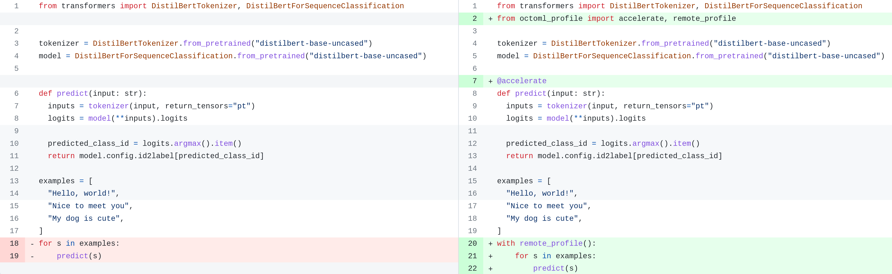

## octoml-profile

octoml-profile is a python library and cloud service
designed to provide the **simplest experience** for assessing and optimizing
the performance of PyTorch models on cloud hardware with state-of-the-art
ML acceleration technology.

It is suited for benchmarking PyTorch based AI applications before
they are deployed into production.

### Documentation quick links

* [Why octoml-profile?](#why-octoml-profile)
* [Installation](#installation)
* [Getting started](#getting-started)
* [Behind the scenes](#behind-the-scenes)
* [Data privacy](#data-privacy)
* [Known issues](#known-issues)
* [Contact the team](#contact-the-team)

### Example required code change



### Example results

```
Profile 1/1 ran 2 times with 10 repeats per call:
   Segment                            Samples  Avg ms  Failures
===============================================================
0  Uncompiled                               2   3.996

1  Graph #1                         
     r6i.large/torch-eager-cpu             20  34.702         0
     g4dn.xlarge/torch-eager-cuda          20   5.088         0
     g4dn.xlarge/torch-inductor-cuda       20   3.221         0
     g4dn.xlarge/onnxrt-cuda               20   1.421         0

2  Uncompiled                               2   0.164

3  Graph #2                         
     r6i.large/torch-eager-cpu             20   0.026         0
     g4dn.xlarge/torch-eager-cuda          20   0.102         0
     g4dn.xlarge/torch-inductor-cuda       20   0.248         0
     g4dn.xlarge/onnxrt-cuda               20   0.053         0

4  Uncompiled                               2   0.126
---------------------------------------------------------------
Total uncompiled code run time: 4.285 ms
Total times (compiled + uncompiled) and on-demand cost per million inferences per backend:
    r6i.large/torch-eager-cpu (Intel Ice Lake)   39.013ms  $1.37
    g4dn.xlarge/torch-eager-cuda (Nvidia T4)      9.475ms  $1.38
    g4dn.xlarge/torch-inductor-cuda (Nvidia T4)   7.754ms  $1.13
    g4dn.xlarge/onnxrt-cuda (Nvidia T4)           5.759ms  $0.84
```


## Why octoml-profile?

Benchmarking deep learning models for cloud deployment is an intricate and
tedious process. This challenge becomes more significant as the boundary
between model and code continues to blur. As we witness in the
rise of generative models and the increasing popularity of PyTorch, exporting
models from code and selecting the optimal hardware deployment
platform and inference backend becomes a daunting task even for expert ML engineers.

With octoml-profile, you can easily run performance/cost measurements on a wide
variety of different hardware and apply state-of-the-art ML acceleration
techniques, all from your development machine, using the same data and workflow used for
training and experiment tracking, without tracing or exporting the model!

Apply just a few code changes, run your code locally, and
you instantly get performance feedback on your model's compute-intensive
tensor operations

- on each hardware instance type
- with automatic application of state-of-the-art ML acceleration technologies
- your model's data shapes and types can vary

but without the burden of

- exporting the models and stitching them back with pre/post processing code
- provisioning the hardware
- preparing the hardware specific dependencies, i.e. the version of PyTorch, Cuda, TensorRT etc.
- sending the model and data to each hardware and running the benchmarking script

This agile loop enables anyone familiar with PyTorch to rapidly iterate over
their model and the choice of hardware / acceleration technique to meet their
deployment goals without "throwing the model over the fence and back".


## Installation

- <a href="https://profiler.app.octoml.ai/">Sign up</a> to generate an API token and set the token as the env var below.
  ```
  export OCTOML_PROFILE_API_TOKEN=<access token>
  ```

- Create and activate a python virtual environment. Make sure that you are using python3.8.

  [Linux]

  using venv:
  ```
  python3 -m venv env
  source env/bin/activate
  ```

  [MacOS]

  using venv:
  ```
  python3 -m venv env
  source env/bin/activate
  ```
  using conda:
  ```
  # Instructions on installing conda on MacOS: https://docs.conda.io/projects/conda/en/latest/user-guide/install/macos.html
  # Choose the Miniconda Installer for you Mac architecture.

  conda create -n octoml python=3.8
  conda activate octoml
  ```
- Ensure pip is up to date
   ```
   pip install --upgrade pip
   ```

- Install torch2.0 stable version
  ```
  pip install torch torchvision torchaudio --index-url https://download.pytorch.org/whl/cpu
  ```

  To use [dynamic shape](#dynamic-shapes) or to pick up the latest improvements in PyTorch graph capture
  technology, install torch-nightly instead.
  ```
  pip install --pre torch==2.1.0.dev20230307 torchaudio==2.0.0.dev20230307 torchvision==0.15.0.dev20230307 --index-url https://download.pytorch.org/whl/nightly/cpu
  ```

- Install octoml-profile
  ```
  pip install "octoml-profile>=0.2.0"
  ```


## Getting Started

All example code, including applications from `transformers`, can be found at [examples/](examples).

Below is a very simple example that shows how to integrate octoml-profile
into your model code.

```python
import torch
import torch.nn.functional as F
from torch.nn import Linear, ReLU, Sequential
from octoml_profile import accelerate, remote_profile

model = Sequential(Linear(100, 200), ReLU(), Linear(200, 10))

@accelerate
def predict(x: torch.Tensor):
    y = model(x)
    z = F.softmax(y, dim=-1)
    return z

# Alternatively you can also directly use `accelerate`
# on a model, e.g. `predict = accelerate(model)` which will leave the
# softmax out of remote execution

with remote_profile():
    for i in range(10):
        x = torch.randn(1, 100)
        predict(x)
```

Running this program results in the following output that shows 
times of the function being executed remotely on each backend.
```
Profile 1/1 ran 9 times with 10 repeats per call:
   Segment                            Samples  Avg ms  Failures
===============================================================
0  Uncompiled                               9   0.020

1  Graph #1                         
     r6i.large/torch-eager-cpu             90   0.037         0
     g4dn.xlarge/torch-eager-cuda          90   0.135         0
     g4dn.xlarge/torch-inductor-cuda       90   0.236         0

2  Uncompiled                               9   0.010
---------------------------------------------------------------
Total uncompiled code run time: 0.029 ms
Total times (compiled + uncompiled) and on-demand cost per million inferences per backend:
    r6i.large/torch-eager-cpu (Intel Ice Lake)   0.066ms  $0.00
    g4dn.xlarge/torch-eager-cuda (Nvidia T4)     0.165ms  $0.02
    g4dn.xlarge/torch-inductor-cuda (Nvidia T4)  0.265ms  $0.04
```
You can think of `Graph #1` as the computation graph which captures
`model` plus `softmax` in the `predict` function. See
the [Uncompiled Segments](#uncompiled-segments) for more information
on the uncompiled blocks.

`Graph #1` shows 90 runs because the `for loop` runs the
`predict` function 10 times. On each loop iteration the model is evaluated
remotely 10 times. However, the result of the first remote run is
discarded because compilation is triggered.

To understand what's happening behind the scenes, read on. To see
more examples, see [examples/](examples).

## Behind the scenes

* [How octoml-profile works](#how-octoml-profile-works)
* [Where `@accelerate` should be applied](#where-accelerate-should-be-applied)
* [The profile report](#the-profile-report)
* [Dynamic shapes](#dynamic-shapes)
* [Quota](#quota)
* [Supported backends](#supported-backends)
* [Uncompiled segments](#uncompiled-segments)

### How octoml-profile works

In the example above, we first decorate the `predict` function with the
`@accelerate` decorator. The behavior of this decorator depends on the context.
By default, it behaves like `@torch.compile`:
[Torch Dynamo](https://pytorch.org/tutorials/intermediate/dynamo_tutorial.html) is used
to extract one or more computation graphs, optimize them, and replace the bytecode
inside the function with the optimized version. 

When the code is surrounded with `remote_profile()` context manager, the behavior
of the `@accelerate` decorator changes. Instead of running the extracted graphs
on the local machine, the graphs are sent to one or more remote inference workers
for execution and measurement. These offloaded graphs are referred to as "compiled segments"
in the output above.

Code that cannot be captured as a computation graph is not offloaded -- such code
runs locally and is shown as "uncompiled segments". For more details on uncompiled code see
the [uncompiled segments section](#uncompiled-segments) below.

When the `remote_profile()` context manager is entered, it reserves
exclusive access to hardware specified in the optional `backends` keyword argument
(or to a set of default hardware targets if the argument is omitted).
If there are multiple backends, they will run in parallel.

The beauty of this example is that the decorator's scope
can be larger than the scope of PyTorch models, whose boundaries
are difficult to carve out exactly.

The `predict` function may contain pre/post processing code, non tensor logic
like control flows, side effects, and multiple models. Only eligible graphs
will be intelligently extracted and offloaded for remote execution.

From a user's perspective the "Total times (compiled + uncompiled) per backend"
is the best estimation of the runtime of decorated function with the chosen 
hardware platform and acceleration library.

### Where `@accelerate` should be applied
In general, `@accelerate` is a drop-in replacement for `@torch.compile`
and should be applied to function which contains PyTorch Model that performs inference.
When the function is called under the context manager of `with remote_profile()`,
the remote execution and profiling activated. When called without `remote_profile()`
it behaves just as TorchDynamo.

If you expect the input shape to change especially for generative models,
see [Dynamic Shapes](#dynamic-shapes).

By default, `torch.no_grad()` is set in the remote_profile context to minimize usage of non
PyTorch code in the decorated function. This minimizes the chance of hitting
`TorchDynamoInternalError`.

Last but not least, `@accelerate` should not be used to decorate a function
that has already been decorated with `@accelerate` or `@torch.compile`.

### The profile report

By default, the `Profile` report table will show the linear sequence of subgraph segment runs.
Note that `segment` indicates a subgraph run, and `subgraph` is a logical portion of the model.

However, when too many segments are run, we collapse the linear segment sequence into an
abridged summary where only a few subgraphs that have the highest aggregate runtimes across
their run segments are shown.
For example, a generative encoder-decoder based model that produces a large number of
run segments will display an abridged report displaying 
**runtime by subgraph** instead of **runtime by segment** by default.
In cases like this, you'll see:

```
Profile 1/1 ran 1 time with 10 repeats per call:
Top subgraph               Avg ms/call  Avg ms/run  Runtime % of e2e  Failures
==============================================================================
Graph #7 (17 calls)      
  r6i.large/onnxrt-cpu          36.979     628.645              70.2         0
  g4dn.xlarge/onnxrt-cuda        5.612      95.403              37.9         0

Graph #4 (1 calls)       
  r6i.large/onnxrt-cpu          43.823      43.823               4.9         0
  g4dn.xlarge/onnxrt-cuda        5.002       5.002               2.0         0

Graph #2 (1 calls)       
  r6i.large/onnxrt-cpu          43.357      43.357               4.8         0
  g4dn.xlarge/onnxrt-cuda        3.154       3.154               1.3         0

4 other subgraphs        
  r6i.large/onnxrt-cpu                      35.892               4.0         0
  g4dn.xlarge/onnxrt-cuda                    4.833               1.9         0

42 uncompiled segments                     143.621
------------------------------------------------------------------------------
Total uncompiled code run time: 143.621 ms
Total times (compiled + uncompiled) and on-demand cost per million inferences per backend:
    r6i.large/onnxrt-cpu (Intel Ice Lake)  895.338ms  $31.34
    g4dn.xlarge/onnxrt-cuda (Nvidia T4)    252.012ms  $36.82
```

Terminology:
- `run` is one full end-to-end execution of an `@accelerate`-decorated function
- `call` is one execution of a subgraph
- `repeats` is the number of times a subgraph is measured on a remote backend for each call

Other graphs are hidden. If your output has been abridged in this way
but you want to see the full, sequential results of your profiling run, you can print
the report with `verbose`:

```python
# print_results_to=None silences the default output profile report.
with remote_profile(print_results_to=None) as prof:
    ...
prof.report().print(verbose=True)
```

### Dynamic shapes

This is an experimental feature.

By default, the `@accelerate` decorator will recompile a new graph if the input
shapes to the graph is changed. For sequence to sequence use cases such as text
generation, it is inefficient to have to compile a separate model for each
possible intermediate sequence length and the amount of graphs will quickly
cause the backend worker to run out of memory. The solution is to turn on
"dynamic-shapes" for the compiler,
which means the graph compiliation will be agnostic to the input shapes,
resulting in drastically fewer graphs to be compiled and lower memory to run
end to end.

As an toy example:

```python
import torch
from octoml_profile import accelerate, remote_profile

conv = torch.nn.Conv2d(16, 16, 3)

# With `dynamic=True` any model inside will not be specialized to the input shape
@accelerate(dynamic=True)
def predict(x: torch.Tensor):
    return conv(x)

with remote_profile(backends=["r6i.large/onnxrt-cpu"]):
    for i in range(5):
        predict(torch.randn(3, 16, 10, 10))
        # batch size is different
        # with `dynamic=True` we will not recompile a different conv graph
        predict(torch.randn(4, 16, 10, 10))
```

This feature is still under active development by the PyTorch team, so your
results may vary. There are known bugs with using dynamic shapes with the torch
eager and inductor backends. To use this experimental feature, please install a
version of nightly torch. We recommend using version 20230307:

```
pip install --pre torch==2.1.0.dev20230307 torchaudio==2.0.0.dev20230307 torchvision==0.16.0.dev20230307 --index-url https://download.pytorch.org/whl/nightly/cpu
```

Set `@accelerate(dynamic=True)` on any `accelerate` usage.
*Important*: we recommend only using ONNXRuntime backends (`onnxrt-cpu`, `onnxrt-cuda`,
`onnxrt-tensorrt`) with `dynamic=True` because of known bugs in `torch-eager-*`
and `torch-inductor-*` backends.


### Quota

Each user has a limit on the number of concurrent backends held by the user's sessions.
If you find yourself hitting quota limits, please ensure you are closing previously held sessions
with `session.close()`. Otherwise, your session will automatically be closed at script exit.

### Supported backends

To programmatically access a list of supported backends, please invoke:

```python
import octoml_profile
print(octoml_profile.get_supported_backends())
```

**Supported Cloud Hardware**

AWS
- g4dn.xlarge (Nvidia T4 GPU)
- g5.xlarge  (Nvidia A10g GPU)
- r6i.large (Intel Xeon IceLake CPU)
- r7g.large (Arm based Graviton3 CPU)

**Supported Acceleration Libraries**

ONNXRuntime
- onnxrt-cpu
- onnxrt-cuda
- onnxrt-tensorrt

PyTorch
- torch-eager-cpu
- torch-eager-cuda
- torch-inductor-cpu
- torch-inductor-cuda

If no backends are specified while calling `remote_profile(backends=[...])`, then defaults are used,
which are determined by the server. At the moment of writing, the default is
`["r6i.large/torch-eager-cpu", "g4dn.xlarge/torch-eager-cuda", "g4dn.xlarge/torch-inductor-cuda"]`.

### Uncompiled segments

You will likely see `Uncompiled segments` in the profiling report. It is caused
by [graph breaks](https://pytorch.org/docs/master/dynamo/troubleshooting.html#graph-breaks)
in the decorated function.

It's easier to illustrate using an example
```python
import torch.nn.functional as F
import time
import torch
from octoml_profile import accelerate, remote_profile

@accelerate
def function_with_graph_breaks(x):
    time.sleep(1) # Uncompiled segment 0
    x = F.relu(x) # graph #1, segment 1
    torch._dynamo.graph_break() # Uncompiled segment 2
    time.sleep(0.1) # continue segment 2
    x = F.relu(x) # graph #2, segment 3
    time.sleep(1) # Uncompiled segment 4
    return x

with remote_profile(backends=['r6i.large/onnxrt-cpu']):
    for _ in range(2):
        function_with_graph_breaks(torch.tensor(1.))
```

```
Profile 1/1:
   Segment             Runs   Mean ms  Failures
===============================================
0  Uncompiled             1  1001.051

1  Graph #1
     r6i.large/onnxrt-cpu 10     0.007         0

2  Uncompiled             1   100.150

3  Graph #2
     r6i.large/onnxrt-cpu 10     0.007         0

4  Uncompiled             1  1000.766
-----------------------------------------------
```
In the example above, we explicitly insert `graph_break`.
In real case, TorchDynamo will automatically
insert graph break when encoutering code that cannot be captured
as part of the computation graph. As a side effect of
us relying on TorchDynamo graph capturing, even a simple function as the one
below will always have Uncompiled segment in the beginning and the end because 
we cannot differentiate if there is non graph user code before or after `relu`.

```python
@accelerate
def simple_function(x):
    # implicit uncompiled segment 0
    x = F.relu(x) # graph #1, segment 1
    # implicit uncompiled segment 2
    return x
```


Uncompiled segment is run locally once for every invocation. The total
uncompiled time is summed up and add to the estimated total time (compiled and
uncompiled).

To print graph breaks and understand more of what TorchDynamo is doing under the hood, see
the [dynamo.explain](https://pytorch.org/tutorials/intermediate/dynamo_tutorial.html#torchdynamo-and-fx-graphs)
and
[PyTorch
Troubleshooting](https://pytorch.org/docs/master/dynamo/troubleshooting.html#torchdynamo-troubleshooting)
pages.


## Data privacy

We know that keeping your model data private is important to you. We guarantee that no other
user has access to your data. We do not scrape any model information internally, and we do not use
your uploaded data to try to improve our system -- we rely on you filing github issues or otherwise
contacting us to understand your use case, and anything else about your model.
Here's how our system currently works.

We leverage TorchDynamo's subgraph capture to identify Pytorch-only code, serialize those subgraphs,
and upload them to our system for benchmark.

On model upload, we cache your model in AWS S3. This helps with your development iteration speed --
every subsequent time you want profiling results, you won't have to wait for model re-upload on every
minor tweak to your model or update to your requested backends list. When untouched for four weeks,
any model subgraphs and constants are automatically removed from S3.

Your model subgraphs are loaded onto our remote workers and are cleaned up on the creation of
every subsequent session. Between your session's closure and another session's startup,
serialized subgraphs may lie around idle. No users can access these subgraphs in this interval.

If you still have concerns around data privacy, please [contact the team](#contact-the-team).

## Known issues

### Waiting for Session
When you create a session, you get exclusive access to the requested hardware.
When there are no hardware available, new session requests will
be queued.

### OOM for large models
When a function contains too many graph breaks or individual
graph excceds the memory on the worker,
the remote inference worker may run out of CPU/GPU memory.
When it happens, you may get an "Error on loading model component". 
This is known to happen with models like Stable Diffusion.
We are actively working on optimizing the memory allocation of 
many subgraphs.

### Limitations of TorchDynamo 
TorchDynamo is under active development. You may encounter
errors that are TorchDynamo related.
These should not be fundamental problems as we believe TorchDynamo
will continue to improve its coverage.
If you find a broken model, please [file an issue](https://github.com/octoml/octoml-profile/issues).

## Contact the team
- Discord: [OctoML community Discord](https://discord.gg/Quc8hSxpMe)
- Github issues: https://github.com/octoml/octoml-profile/issues
- Email: dynamite@octoml.ai
